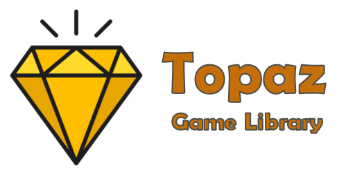

<a href="https://topazgamelibrary.com" target="_blank"></a>

[](https://discord.gg/tPWjMwK) [](https://github.com/tinyBigGAMES/Topaz/stargazers) [](https://github.com/tinyBigGAMES/Topaz/network/members) [](https://github.com/tinyBigGAMES/Topaz/network/members)
[](https://twitter.com/topazgamelib)

## Overview
Topaz Game Library&trade; is a 2D professional indie game library that allows you to do game development in <a href="https://www.embarcadero.com/products/delphi" target="_blank">Delphi</a> for desktop PC's running Microsoft Windows® and uses OpenGL® for hardware accelerated rendering.

It's robust, designed for easy use and suitable for making all types of 2D games and other graphic simulations, You access the features from a simple and intuitive API, to allow you to rapidly and efficiently develop your projects. There is support for bitmaps, audio samples, streaming music, video playback, loading resources directly from a compressed and encrypted archive, a thin object oriented actor/scene system, entity state machine, sprite management, collision detection and much more. Topaz Game Library, easy, fast & fun!

## Downloads
<a href="https://github.com/tinyBigGAMES/Topaz/archive/refs/heads/main.zip" target="_blank">**Development**</a> - This build represents the most recent development state an as such may or may not be as stable as the official release versions. If you like living on the bleeding edge, it's updated frequently (often daily) and will contain bug fixes and new features.

<a href="https://github.com/tinyBigGAMES/Topaz/releases" target="_blank">**Releases**</a> - These are the official release versions and deemed to be the most stable.

## Features
- **Free** for non-commercial use. See <a href="https://github.com/tinyBigGAMES/Topaz/blob/main/LICENSE" target="_blank">License agreement</a>.
- Written in **Object Pascal**
- Support Windows 64 bit platform
- Hardware accelerated with **OpenGL**
- You interact with Topaz via your derived `TGame` class and the various classes and routines in the `Topaz` unit.
- **Archive** (custom archive format, password protection)
- **Window** (OpenGL, anti-aliasing, vsync, viewports, primitives, blending)
- **Input** (keyboard, mouse and joystick)
- **Texture** (color key transparency, scaling, rotation, flipped, titled,  BMP, DDS, PCX, TGA, JPEG, PNG)
- **Video** (play, pause, rewind, OGV format)
- **Sprite** (pages, groups, animation, poly-point collision)
- **Entity** (defined from a sprite, position, scale, rotation, collision)
- **Audio** (samples, streams, WAV, OGG/Vorbis, FLAC formats)
- **Font** (true type, scale, rotate)
- **Timing** (time-based, frame elapsed, frame speed)
- **Shaders** (vertex, fragment, GLSL)
- **Misc** (collision, easing, screen shake, screenshot, starfield, colors, INI based config files, startup dialog, treeview menu)

## Minimum System Requirements
- Delphi Community Edition
- Microsoft Windows 10, 64 bits
- OpenGL 3

## How to use in Delphi
- Unzip the archive to a desired location.
- Add `installdir\sources`, folder to Delphi's library path so the toolkit source files can be found for any project or for a specific project add to its search path.
- In Delphi, load `Topaz Game Library.groupproj` to load and compile the project files.
- Compile and use `ZipArc` utility for making archive files (standard password protected zip format). Running the `makearc.bat` in `installdir\bin` will build `Data.arc` that is used by the examples.
- Compile and run the various examples which will showcase the toolkit features and how to use them.
- See examples in the `installdir\examples` for more information about usage.
- You must include `TGL.dll` in your project distribution.

## Known Issues
- This project is in active development so changes will be frequent 
- Documentation is WIP. They will continue to evolve
- More examples will continually be added over time

## A Tour of Topaz Game Library
### Game Object
You just have to derive a new class from the `TGame` base class and override a few callback methods. You access the toolkit functionality from the `TopazGameLib` unit.
```pascal
uses
  TopazGameLib;

type
  { TMyGame }
  TMyGame = class(TGame)
  public
    procedure OnSetSettings(var aSettings: TGVSettings); override;
    procedure OnStartup; override;
    procedure OnShutdown; override;
    procedure OnUpdate(aDeltaTime: Double); override;
    procedure OnRender; override;
    procedure OnRendeHUD; override;
  end;
```
### How to use
A minimal implementation example:
```pascal

{ TMyGame }
procedure TMyGame.OnSetSettings(var aSettings: TGVSettings);
begin
  inherited;
  
  // add your settings code  
  aSettings.WindowWidth := 960;
  aSettings.WindowHeight := 540;
  aSettings.WindowTitle := 'My Game';
  aSettings.WindowClearColor := DARKSLATEBROWN;  
end;

procedure TMyGame.OnStartup;
begin
  inherited;
  
  // add your own startup code
end;

procedure TMyGame.OnShutdown;
begin
  // add your shutdown code
  
  inherited;
end;

procedure TMyGame.OnUpdate(aDeltaTime: Double);
begin
  inherited;
  
  // add your update code
end;

procedure TMyGame.OnRender;
begin
  inherited;
  
  // render your render code
end;

procedure TMyGame.OnRenderHUD;
begin
  inherited;
  
  // add your render HUD code 
end;
```
To run your game, call
```pascal
Topaz.RunGame(TMyGame);
```
**NOTE:** For a Topaz game to work properly, execution MUST start with `Topaz.RunGame(...)`.

See the examples for more information on usage.

## Media


https://user-images.githubusercontent.com/69952438/175956603-33c2e4bd-bb6b-4424-910c-47b9f6063903.mp4


## Support
<table>
<tbody>
	<tr>
		<td>Website</td>
		<td><a href="https://topazgamelib.com">https://topazgamelibrary.com</a></td>
	</tr>
	<tr>
		<td>Discussions</td>
		<td><a href="https://github.com/tinyBigGAMES/Topaz/discussions">https://github.com/tinyBigGAMES/Topaz/discussions</a></td>
	</tr>
	<tr>
		<td>Issue Tracking</td>
		<td><a href="https://github.com/orgs/tinyBigGAMES/projects/4">https://github.com/orgs/tinyBigGAMES/projects/4</a></td>
	</tr>
	<tr>
		<td>Facebook Page</td>
		<td><a href="https://facebook.com/topazgamelib">https://facebook.com/topazgamelib</a></td>
	</tr>
		<tr>
		<td>Facebook Group</td>
		<td><a href="https://facebook.com/groups/topazgamelib">https://facebook.com/groups/topazgamelib</a></td>
	</tr>
	<tr>
		<td>Twitter</td>
		<td><a href="https://twitter.com/topazgamelib">https://twitter.com/topazgamelib</a></td>
	</tr>
	<tr>
		<td>Discord</td>
		<td><a href="https://discord.gg/tPWjMwK">https://discord.gg/tPWjMwK</a></td>
	</tr>
	<tr>
		<td>YouTube</td>
		<td><a href="https://vimeo.com/tinyBigGAMES">https://youtube.com/tinyBigGAMES</a></td>
	</tr>
</tbody>
</table>

<p align="center">
 <a href="https://www.embarcadero.com/products/delphi" target="_blank"></a><br/>
 ♥ <b>Made for Delphi</b>
</p>
